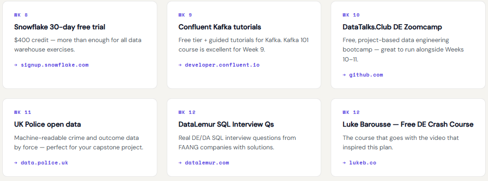

# 🚀 Data Engineering Roadmap — 3-Month Learning Plan

> **Olugbenga Adeoye** · Data Analyst & Power BI Developer → Data Engineer  
> Built on the framework by [Luke Barousse](https://www.youtube.com/@LukeBarousse) — *"How I Would Learn to be a Data Engineer"*  
> 📺 Original video: [youtube.com/watch?v=_-DzZeixu0w](https://www.youtube.com/watch?v=_-DzZeixu0w)

---

## 📸 Screenshots

### 1. Portfolio Tracker — Overview Tab
> **What to screenshot:** The Overview tab showing the four stat cards (Weeks Done, In Progress, Days to Go, Skills Unlocked), the three phase progress bars, and the full skill tracker grid below.  
> *Caption suggestion: "My live progress tracker — built to keep me accountable across 12 weeks."*

---

### 2. Phase 1 — Foundations, Part 1 (Weeks 1–2)
> **What to screenshot:** The Phase 1 tab scrolled to show the first two week cards — "CLI, Git & Python basics" and "SQL — deep dive" — with topic lists and amber real-world task boxes clearly visible.  
> *Caption suggestion: "Week 1–2: Terminal, Git, Python scripting and advanced SQL — the foundations everything else is built on."*

---

### 3. Phase 1 — Foundations, Part 2 (Weeks 3–4) + Milestone
> **What to screenshot:** The Phase 1 tab scrolled down to show week cards 3 and 4 ("Python for data" and "Cloud + storage fundamentals"), plus the green Month 1 checkpoint milestone banner at the bottom.  
> *Caption suggestion: "By end of Month 1: Python pipelines, cloud storage on AWS S3, and a growing GitHub repo."*

---

### 4. Phase 2 — Pipelines & Transformation, Part 1 (Weeks 5–7)
> **What to screenshot:** The Phase 2 tab showing the first three week cards — ETL/ELT patterns, dbt, and Airflow — ideally with one card marked "✓ Done" and one marked "⟳ In progress" to show live progress.  
> *Caption suggestion: "Phase 2 is where the real engineering begins — ELT pipelines, dbt transformations and Airflow orchestration."*

---

### 5. Phase 2 — Pipelines & Transformation, Part 2 (Weeks 8–9) + Milestone
> **What to screenshot:** The Phase 2 tab scrolled down to show week cards 8 and 9 (Snowflake data warehousing and Kafka streaming), plus the Month 2 checkpoint milestone banner.  
> *Caption suggestion: "Star schema design in Snowflake and live Wikipedia streams through Kafka — Month 2 complete."*

---

### 6. Phase 3 — Production & Job Prep (Weeks 10–12) + Milestone
> **What to screenshot:** The full Phase 3 tab showing all three week cards — CI/CD & Docker, Capstone project, and Interview prep — along with the final Month 3 checkpoint milestone banner at the bottom.  
> *Caption suggestion: "Phase 3: production-grade pipelines, a live capstone project, and interview-ready system design skills."*

---

### 7. Resources Tab, Part 1
> **What to screenshot:** The Resources tab showing the first two rows of resource cards — MIT Missing Semester, Mode SQL Tutorial, Python for Data Analysis, AWS Free Tier, Fundamentals of Data Engineering and DuckDB Docs — with week labels, titles, descriptions and links all visible.  
> *Caption suggestion: "Every resource mapped to a specific week — no guessing what to learn next or when."*

---

### 8. Resources Tab, Part 2
> **What to screenshot:** The Resources tab scrolled down to show the remaining cards — dbt Learn, Astronomer Airflow, Snowflake Trial, Confluent Kafka, DataTalks DE Zoomcamp, UK Police Open Data, DataLemur and Luke Barousse's free crash course card.  
> *Caption suggestion: "15 curated free resources — from dbt Learn to DataLemur SQL interview questions and Luke Barousse's DE crash course."*

---

## 🗺️ The Plan at a Glance

This is a structured, project-based roadmap covering everything needed to transition from Data Analyst to Data Engineer in 3 months. Every week has a **real-world task** using public datasets and free tools — no toy exercises.

---

## 📅 Phase 1 — Foundations (Weeks 1–4)

*Goal: Build the non-negotiable base layer before touching any pipeline tooling.*

| Week | Topic | Real-World Task |
|------|-------|----------------|
| 1 | CLI, Git & Python basics | Python script that reads a CSV and prints row counts |
| 2 | SQL — deep dive | Query StackOverflow dataset on BigQuery — top 10 tags by year |
| 3 | Python for data | Pull CoinGecko API → store as Parquet → 7-day rolling average |
| 4 | Cloud + storage fundamentals | Deposit daily weather data (Open-Meteo API) to S3 as Parquet |

**Month 1 checkpoint:** Able to write Python, query SQL confidently, use Git, and deposit files to cloud storage. All work committed to GitHub.

---

## ⚙️ Phase 2 — Pipelines & Transformation (Weeks 5–9)

*Goal: Build a complete ELT pipeline using industry-standard tools.*

| Week | Topic | Real-World Task |
|------|-------|----------------|
| 5 | ETL/ELT patterns | London air quality ELT — raw JSON to S3 → transform with DuckDB |
| 6 | dbt | Staging → intermediate → mart models with schema tests |
| 7 | Apache Airflow orchestration | Daily DAG + dbt trigger + Slack failure alert |
| 8 | Data warehousing (Snowflake) | Star schema: fact_orders, dim_customer, dim_date |
| 9 | Streaming intro (Kafka) | Live Wikipedia edits → Kafka topic → DuckDB table |

**Month 2 checkpoint:** Full end-to-end ELT pipeline: ingest → cloud storage → dbt → data warehouse → Airflow scheduling. Portfolio project core complete.

---

## 🎯 Phase 3 — Production & Job Prep (Weeks 10–12)

*Goal: Production-ready mindset, a live capstone project, and interview-ready skills.*

| Week | Topic | Real-World Task |
|------|-------|----------------|
| 10 | CI/CD, Docker & Terraform | GitHub Actions workflow that blocks PR merge if dbt tests fail |
| 11 | Capstone project | UK Crime Analytics — police.uk data → dbt → Looker Studio dashboard |
| 12 | Interview prep | Mock system design: "Real-time fraud detection pipeline for a UK bank" |

**Month 3 checkpoint:** Live end-to-end GitHub project published, confident answering SQL and system design interview questions. Ready to apply for Data Engineer roles.

---

## 🛠️ Tech Stack Covered

| Layer | Tools |
|-------|-------|
| Language | Python, SQL, PySpark |
| Ingestion | Apache Kafka, Azure Data Factory, REST APIs |
| Transformation | dbt, DuckDB, Dataflows Gen2 |
| Storage | AWS S3, Azure Blob, Snowflake, BigQuery |
| Orchestration | Apache Airflow |
| Infrastructure | Docker, Terraform, GitHub Actions (CI/CD) |
| Visualisation | Looker Studio, Metabase, Power BI |
| Version Control | Git, GitHub |

---

## 📚 Key Resources

| Week | Resource | Link |
|------|----------|------|
| Wk 1 | The Missing Semester (MIT) | [missing.csail.mit.edu](https://missing.csail.mit.edu/) |
| Wk 1–2 | Mode SQL Tutorial | [mode.com/sql-tutorial](https://mode.com/sql-tutorial/) |
| Wk 3 | Python for Data Analysis (Wes McKinney) | [wesmckinney.com/book](https://wesmckinney.com/book/) |
| Wk 4 | AWS Free Tier | [aws.amazon.com/free](https://aws.amazon.com/free/) |
| Wk 5 | Fundamentals of Data Engineering (O'Reilly) | [oreilly.com](https://www.oreilly.com/library/view/fundamentals-of-data/9781098108298/) |
| Wk 5 | DuckDB Docs | [duckdb.org/docs](https://duckdb.org/docs/) |
| Wk 6 | dbt Learn (free) | [courses.getdbt.com](https://courses.getdbt.com/) |
| Wk 7 | Astronomer Airflow Tutorials | [docs.astronomer.io/learn](https://docs.astronomer.io/learn/) |
| Wk 8 | Snowflake 30-day Free Trial | [signup.snowflake.com](https://signup.snowflake.com/) |
| Wk 9 | Confluent Kafka Tutorials | [developer.confluent.io](https://developer.confluent.io/learn-kafka/) |
| Wk 10 | DataTalks.Club DE Zoomcamp | [github.com/DataTalksClub](https://github.com/DataTalksClub/data-engineering-zoomcamp) |
| Wk 11 | UK Police Open Data | [data.police.uk](https://data.police.uk/docs/) |
| Wk 12 | DataLemur SQL Interview Questions | [datalemur.com](https://datalemur.com/) |
| All | Luke Barousse Free DE Crash Course | [lukeb.co/de-crash-course](https://lukeb.co/de-crash-course) |

---

## 🙏 Credit & Inspiration

This roadmap was built on the framework laid out by **Luke Barousse** in his video  
*"How I Would Learn to be a Data Engineer"* — one of the clearest, most practical introductions to the field available.

- 📺 YouTube: [@LukeBarousse](https://www.youtube.com/@LukeBarousse)
- 🎓 Free course: [lukeb.co/de-crash-course](https://lukeb.co/de-crash-course)
- 💼 LinkedIn: [linkedin.com/in/luke-b](https://www.linkedin.com/in/luke-b/)

If you're starting your own DE journey, his content is the best place to begin.

---

## 📬 Connect with Me

- 💼 LinkedIn: [linkedin.com/in/olugbenga-adeoye](https://www.linkedin.com/in/olugbenga-adeoye)
- 🐙 GitHub: [github.com/OlugbengaAdeoye](https://github.com/OlugbengaAdeoye)

---

*Started: May 2026 · Target completion: August 2026*  
*"Certificates validate skills — but real projects are what employers evaluate."*
