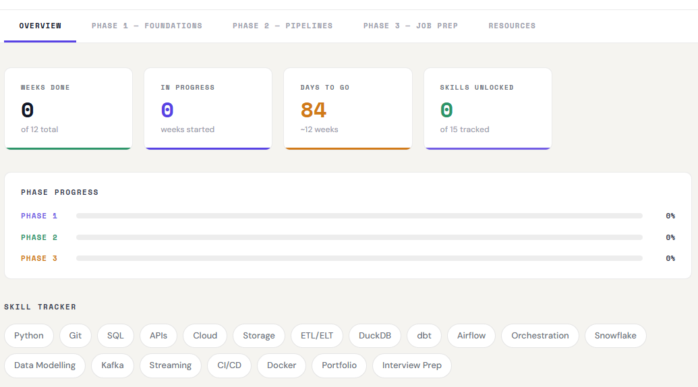
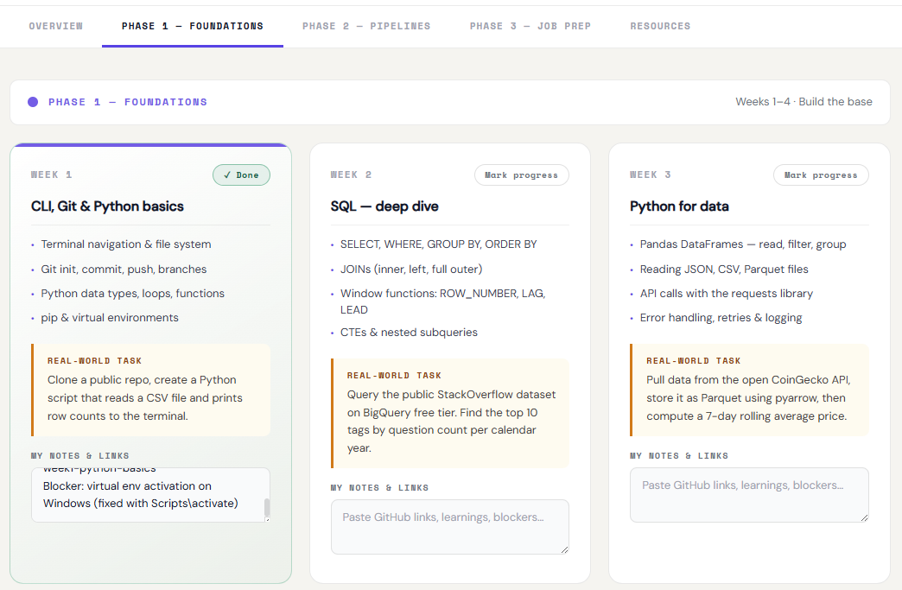
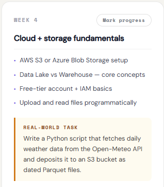
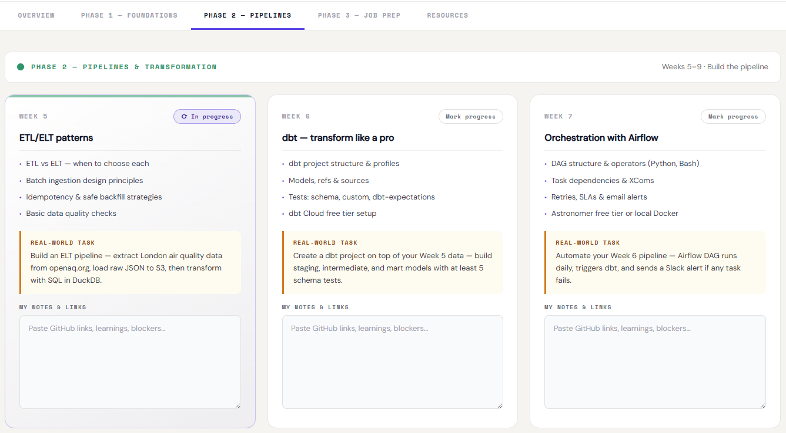
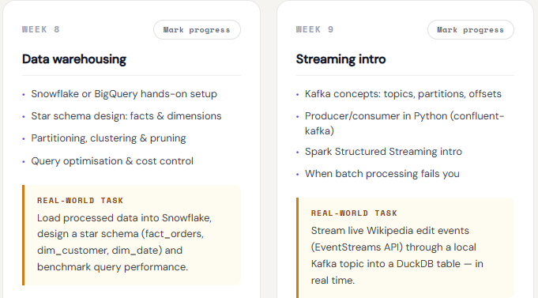
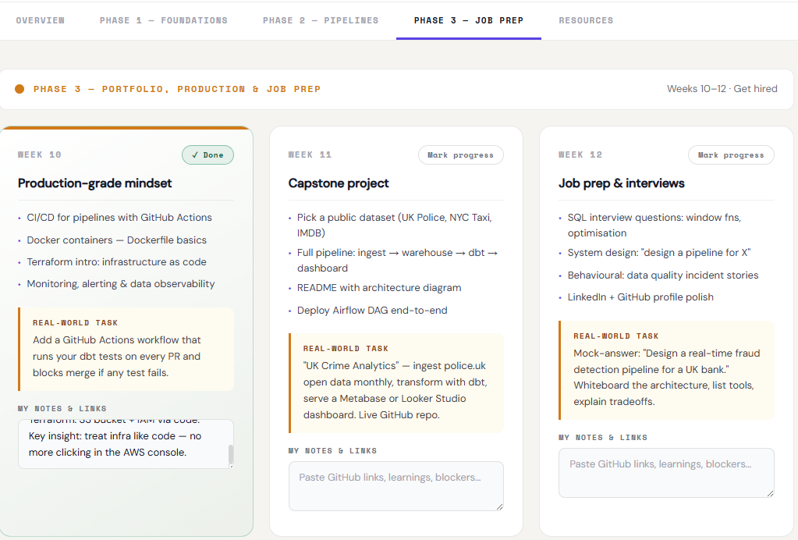
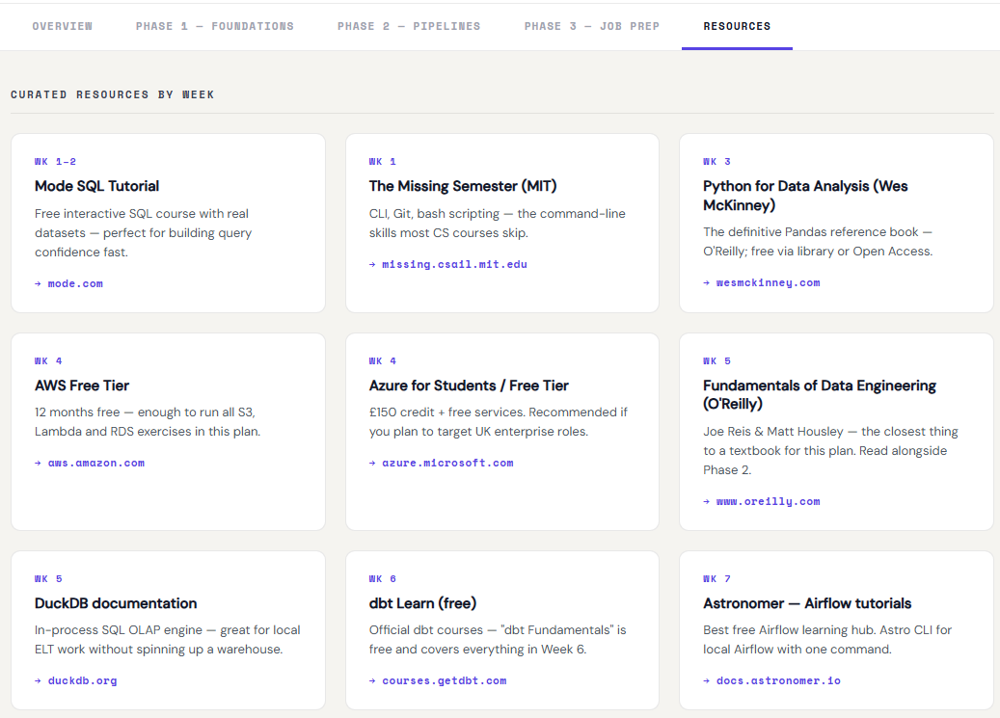

# 🚀 Data Engineering Roadmap — 3-Month Learning Plan

> **Olugbenga Adeoye** · Data Analyst & Power BI Developer → Data Engineer  
> Built on the framework by [Luke Barousse](https://www.youtube.com/@LukeBarousse) — *"How I Would Learn to be a Data Engineer"*  
> 📺 Original video: [youtube.com/watch?v=_-DzZeixu0w](https://www.youtube.com/watch?v=_-DzZeixu0w)

---

## 📸 Screenshots

### 1. Overview — Live Progress Dashboard
> **What's shown:** Stat cards showing **1 Week Done**, **2 In Progress**, **84 Days to Go**, **2 Skills Unlocked**. Phase progress bars with Phase 1 at 25%, Phases 2 and 3 at 0%. Skill tracker grid with Python, Git and SQL highlighted green (unlocked), ETL/ELT and DuckDB highlighted indigo (in progress), and remaining skills greyed out.  
> *"My live 12-week tracker — Week 1 complete, Week 2 underway, Python and Git already unlocked."*

---

### 2. Phase 1 — Foundations (Weeks 1–3)
> **What's shown:** Three side-by-side week cards under the purple Phase 1 — Foundations header. **Week 1 (CLI, Git & Python basics)** marked ✓ Done with notes filled in: repo link, row count result and Windows blocker fix. **Week 2 (SQL — deep dive)** marked ⟳ In progress. **Week 3 (Python for data)** at Mark progress. All amber REAL-WORLD TASK boxes and MY NOTES & LINKS fields visible.  
> *"Weeks 1–3 laid out — Git & Python done, SQL deep dive underway, Python for data coming next."*

---

### 3. Phase 1 — Foundations (Week 4)
> **What's shown:** A close-up of the **Week 4 (Cloud + storage fundamentals)** card showing all four topic bullets (AWS S3 or Azure Blob setup, Data Lake vs Warehouse, Free-tier account + IAM basics, Upload and read files programmatically), the amber real-world task box (Open-Meteo API → S3 Parquet files), and an empty MY NOTES & LINKS field at Mark progress status.  
> *"Week 4 queued up — cloud storage fundamentals and the first AWS S3 pipeline task."*

---

### 4. Phase 2 — Pipelines & Transformation (Weeks 5–7)
> **What's shown:** Three side-by-side week cards under the green Phase 2 — Pipelines & Transformation header. **Week 5 (ETL/ELT patterns)** marked ⟳ In progress. **Week 6 (dbt — transform like a pro)** and **Week 7 (Orchestration with Airflow)** both at Mark progress. All real-world task boxes and empty notes fields visible.  
> *"Phase 2 open — ELT patterns in progress, dbt and Airflow queued up."*

---

### 5. Phase 2 — Pipelines & Transformation (Weeks 8–9)
> **What's shown:** Two cards side by side — **Week 8 (Data warehousing)** covering Snowflake/BigQuery, star schema design, partitioning and query optimisation; **Week 9 (Streaming intro)** covering Kafka concepts, producer/consumer in Python and Spark Structured Streaming. Both at Mark progress with empty notes fields.  
> *"Weeks 8–9 ahead — Snowflake star schema design and live Kafka streaming."*

---

### 6. Phase 3 — Portfolio, Production & Job Prep (Weeks 10–12)
> **What's shown:** All three week cards under the amber Phase 3 — Portfolio, Production & Job Prep header. **Week 10 (Production-grade mindset)** — CI/CD, Docker, Terraform, monitoring. **Week 11 (Capstone project)** — UK Crime Analytics full pipeline. **Week 12 (Job prep & interviews)** — SQL questions, system design, behavioural prep, LinkedIn & GitHub polish. All at Mark progress with empty notes fields.  
> *"Phase 3 mapped out — production pipelines, a live capstone, and interview-ready by Week 12."*

---

### 7. Resources — All 15 Curated Resources
> **What's shown:** The full Resources tab in a 4-column grid across 4 rows showing all 15 resource cards with week labels, titles, descriptions and links. Row 1: Mode SQL Tutorial (Wk 1–2), The Missing Semester MIT (Wk 1), Python for Data Analysis (Wk 3), AWS Free Tier (Wk 4). Row 2: Azure for Students (Wk 4), Fundamentals of Data Engineering O'Reilly (Wk 5), DuckDB documentation (Wk 5), dbt Learn (Wk 6). Row 3: Astronomer Airflow tutorials (Wk 7), Snowflake 30-day free trial (Wk 8), Confluent Kafka tutorials (Wk 9), DataTalks.Club DE Zoomcamp (Wk 10). Row 4: UK Police open data (Wk 11), DataLemur SQL Interview Qs (Wk 12), Luke Barousse Free DE Crash Course (Wk 12).  
> *"15 free resources mapped week by week — from MIT's Missing Semester to Luke Barousse's DE crash course."*

---

## 🗺️ The Plan at a Glance

This is a structured, project-based roadmap covering everything needed to transition from Data Analyst to Data Engineer in 3 months. Every week has a **real-world task** using public datasets and free tools — no toy exercises.

---

## 📅 Phase 1 — Foundations (Weeks 1–4)

*Goal: Build the non-negotiable base layer before touching any pipeline tooling.*

| Week | Topic | Real-World Task |
|------|-------|----------------|
| 1 | CLI, Git & Python basics | Python script that reads a CSV and prints row counts |
| 2 | SQL — deep dive | Query StackOverflow dataset on BigQuery — top 10 tags by year |
| 3 | Python for data | Pull CoinGecko API → store as Parquet → 7-day rolling average |
| 4 | Cloud + storage fundamentals | Deposit daily weather data (Open-Meteo API) to S3 as Parquet |

**Month 1 checkpoint:** Able to write Python, query SQL confidently, use Git, and deposit files to cloud storage. All work committed to GitHub.

---

## ⚙️ Phase 2 — Pipelines & Transformation (Weeks 5–9)

*Goal: Build a complete ELT pipeline using industry-standard tools.*

| Week | Topic | Real-World Task |
|------|-------|----------------|
| 5 | ETL/ELT patterns | London air quality ELT — raw JSON to S3 → transform with DuckDB |
| 6 | dbt | Staging → intermediate → mart models with schema tests |
| 7 | Apache Airflow orchestration | Daily DAG + dbt trigger + Slack failure alert |
| 8 | Data warehousing (Snowflake) | Star schema: fact_orders, dim_customer, dim_date |
| 9 | Streaming intro (Kafka) | Live Wikipedia edits → Kafka topic → DuckDB table |

**Month 2 checkpoint:** Full end-to-end ELT pipeline: ingest → cloud storage → dbt → data warehouse → Airflow scheduling. Portfolio project core complete.

---

## 🎯 Phase 3 — Production & Job Prep (Weeks 10–12)

*Goal: Production-ready mindset, a live capstone project, and interview-ready skills.*

| Week | Topic | Real-World Task |
|------|-------|----------------|
| 10 | CI/CD, Docker & Terraform | GitHub Actions workflow that blocks PR merge if dbt tests fail |
| 11 | Capstone project | UK Crime Analytics — police.uk data → dbt → Looker Studio dashboard |
| 12 | Interview prep | Mock system design: "Real-time fraud detection pipeline for a UK bank" |

**Month 3 checkpoint:** Live end-to-end GitHub project published, confident answering SQL and system design interview questions. Ready to apply for Data Engineer roles.

---

## 🛠️ Tech Stack Covered

| Layer | Tools |
|-------|-------|
| Language | Python, SQL, PySpark |
| Ingestion | Apache Kafka, Azure Data Factory, REST APIs |
| Transformation | dbt, DuckDB, Dataflows Gen2 |
| Storage | AWS S3, Azure Blob, Snowflake, BigQuery |
| Orchestration | Apache Airflow |
| Infrastructure | Docker, Terraform, GitHub Actions (CI/CD) |
| Visualisation | Looker Studio, Metabase, Power BI |
| Version Control | Git, GitHub |

---

## 📚 Key Resources

| Week | Resource | Link |
|------|----------|------|
| Wk 1 | The Missing Semester (MIT) | [missing.csail.mit.edu](https://missing.csail.mit.edu/) |
| Wk 1–2 | Mode SQL Tutorial | [mode.com/sql-tutorial](https://mode.com/sql-tutorial/) |
| Wk 3 | Python for Data Analysis (Wes McKinney) | [wesmckinney.com/book](https://wesmckinney.com/book/) |
| Wk 4 | AWS Free Tier | [aws.amazon.com/free](https://aws.amazon.com/free/) |
| Wk 5 | Fundamentals of Data Engineering (O'Reilly) | [oreilly.com](https://www.oreilly.com/library/view/fundamentals-of-data/9781098108298/) |
| Wk 5 | DuckDB Docs | [duckdb.org/docs](https://duckdb.org/docs/) |
| Wk 6 | dbt Learn (free) | [courses.getdbt.com](https://courses.getdbt.com/) |
| Wk 7 | Astronomer Airflow Tutorials | [docs.astronomer.io/learn](https://docs.astronomer.io/learn/) |
| Wk 8 | Snowflake 30-day Free Trial | [signup.snowflake.com](https://signup.snowflake.com/) |
| Wk 9 | Confluent Kafka Tutorials | [developer.confluent.io](https://developer.confluent.io/learn-kafka/) |
| Wk 10 | DataTalks.Club DE Zoomcamp | [github.com/DataTalksClub](https://github.com/DataTalksClub/data-engineering-zoomcamp) |
| Wk 11 | UK Police Open Data | [data.police.uk](https://data.police.uk/docs/) |
| Wk 12 | DataLemur SQL Interview Questions | [datalemur.com](https://datalemur.com/) |
| All | Luke Barousse Free DE Crash Course | [lukeb.co/de-crash-course](https://lukeb.co/de-crash-course) |

---

## 🙏 Credit & Inspiration

This roadmap was built on the framework laid out by **Luke Barousse** in his video  
*"How I Would Learn to be a Data Engineer"* — one of the clearest, most practical introductions to the field available.

- 📺 YouTube: [@LukeBarousse](https://www.youtube.com/@LukeBarousse)
- 🎓 Free course: [lukeb.co/de-crash-course](https://lukeb.co/de-crash-course)
- 💼 LinkedIn: [linkedin.com/in/luke-b](https://www.linkedin.com/in/luke-b/)

If you're starting your own DE journey, his content is the best place to begin.

---

## 📬 Connect with Me

- 💼 LinkedIn: [Olugbenga Adeoye | LinkedIn](https://www.linkedin.com/in/olugbenga-adeoye-72713b253/)
- 🐙 GitHub: [github.com/OlugbengaHub](https://github.com/OlugbengaHub)

---

*Started: May 2026 · Target completion: August 2026*  
*"Certificates validate skills — but real projects are what employers evaluate."*
